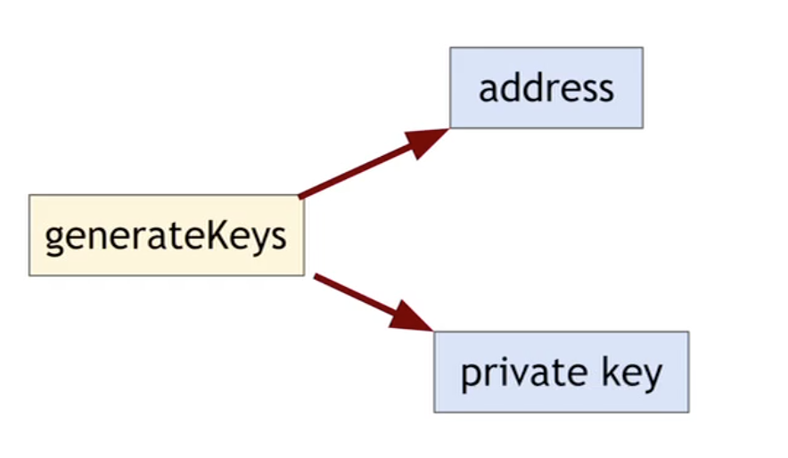
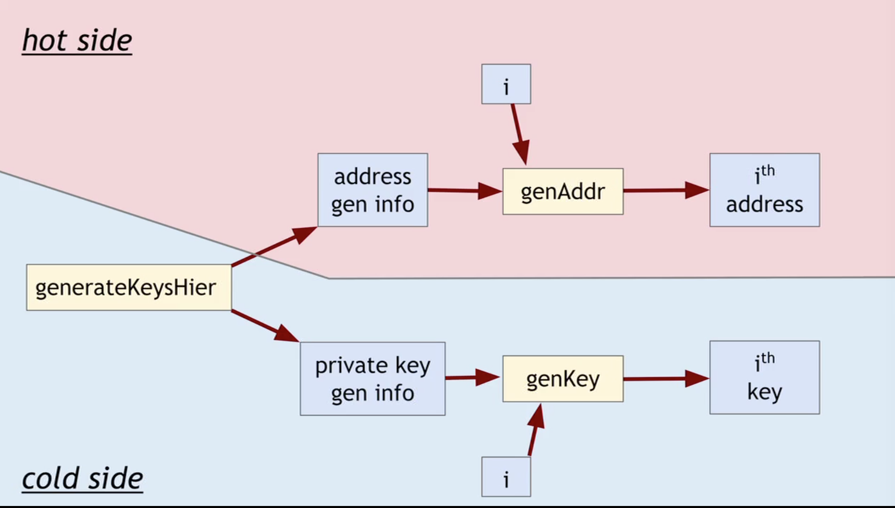
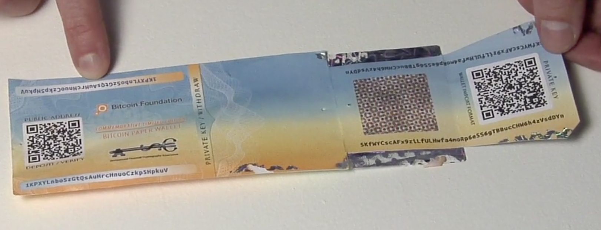
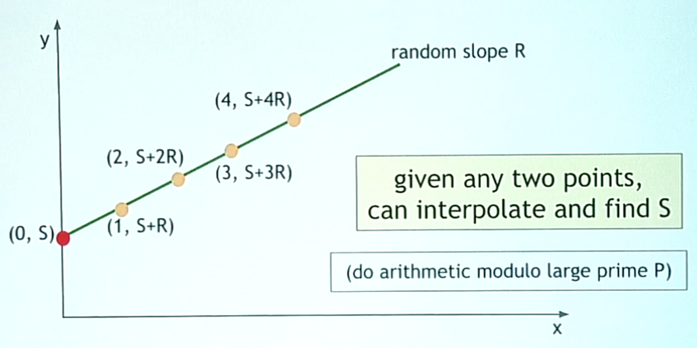

## Part 1 How to Store and Use Bitcoins

### To spend a Bitcoin

To spend a Bitcoin, you need to know:

- some info from the public blockchain
- the owner's secret signing key

So it's all about key management.

### Goals

- Availability: 

  You can spend your coins

- Security: 

  Nobody else can spend your coins

- Convenience

### Simplest Approach

- Store key in a file on your computer or phone
- Very convenient
- As available as your device
  - device lost/wiped => key lost => coins lost
- As secure as your device
  - device compromised => key leaked => coins stolen

### Wallet Software

Keep track of your coins, provides nice user interface.

**Nice Trick:** use a separate address/key for each coin.

- benefits privacy (looks like separate owners, maximum degree of anonymity)
- wallet can do the bookkeeping, the user needn't know

### Encoding addresses(to exchange with somebody)

- Encode as text string: `base58` notation
- Or use QR code version of the string

## Part 2 Hot and Cold Storage

### Hot vs Cold

| Hot Storage                | Cold Storage               |
| -------------------------- | -------------------------- |
| online                     | offline                    |
| convenient but risky       | archival but safer         |
| Separate keys for security | Separate keys for security |
| **hot secret keys**        | **cold secret keys**       |
| **cold addresses**         | **hot addresses**          |

- Holding each other's `keys` and `addresses` allows payments between hot storage and cold storage. Like **checking** and **saving** accounts.
- In practice, **cold storage** is not online. Even if it's offline, **cold storage** can still accept payments.

### Problem #1 

- **Issue:** Want to use a new address&key for each coin sent to cold storage for privacy reasons.

- **Solution**

  - Awkward solution:

    Generate a big batch of addresses/keys, transfer to hot beforehand.

    - If we run out of addresses in hot wallet, nothing we can do.

  - Better solution:

    **Hierarchical wallet**

### Hierarchical wallet

- Regular key generation:

  

- Hierarchical key generation:

  

  1. At the very beginning, do `generateKeysHier` .

     Then `private key gen info` on the cold side, and `address gen info` on the hot side.

  2. Then the hot side can generate the entire sequence on its own.

  3. On the private side, we can generate private keys later.

  4. No further communication is required after once in the beginning. And we will never run out of coins.

### How to store cold info

1. Info stored in device, device locked in a safe

2. **Brain wallet:** encrypt info under passphrase that user remembers

3. **Paper wallet:** print info on paper, lock up paper

   

4. **In "*tamperproof*" device:** device will sign things for you, but won't divulge keys

## Part 3 Splitting and Sharing Keys

### Secret Sharing

- **Idea:** Split secret into $N$ pieces such that
  - Given any $K$ pieces , can reconstruct the secret
  - Given Fewer than $K$ pieces, don't learn anything

- **Example:**
  - $N=2$, $K=2$
  - $P = \text{a large prime}$
  - $S = secret \in [0, P)$
  - $R= random \in [0, P)$
  - **Splitting:**
    - $X_1 = (S+R) \mod P$
    - $X_2 = (S + 2R)  \mod P$
    - Reconstruct: $2(X_1 - X_2) \mod P = S$

- What if we want a large $N$ but keep $K=2$?

  Use interpolation.

- What if we have $K > 2$ ?

  We can continue the same scheme with higher-order polynomials. We can take any `secret` and split with this scheme. <u>It supports $K\mbox{-}out\mbox{-}of\mbox{-}N$ splitting, for any $K, N$.</u>

  | Equation                            | Random Parameters | Points needed to recover S |
  | ----------------------------------- | ----------------- | -------------------------- |
  | $(S+RX) \mod P$                     | $R$               | 2                          |
  | $(S+R_1X + R_2X^2) \mod P$          | $R_1, R_2$        | 3                          |
  | $(S+R_1X + R_2X^2 + R_3X^3) \mod P$ | $R_1, R_2, R_3$   | 4                          |

### Pros/Cons of Sharing

- Good: 
  - Store shares separately, adversary must compromise several shares to get the key.
  - We can lose share.
- Bad:
  - To sign, need to bring shares together, reconstruct the key. **(Vulnerable)**
    - Recall `multi-sig`, it's conceptually the same.
    - But we can keep shares apart, approve transaction without reconstructing key at any point.
- **Example**
  - Andrew, Arvind, Ed, and Joseph are co-worders. Their company has lots of Bitcoins.
  - Each of four generates a key-pair, puts secret keys in a safe, private, offline place.
  - The company's cold-stored coins use multi-sig, so that three of the four keys must sign to release a coin.