# Mechanics of Bitcoin

## Part 1 Bitcoin Transactions

### Recap: Bitcoin consensus

Bitcoin consensus gives us:

- Append-only ledger
- Decentralized consensus
- Miners to validate transactions

**Assuming a currency exists to motivate miners**

### An account-based ledger (not Bitcoin)

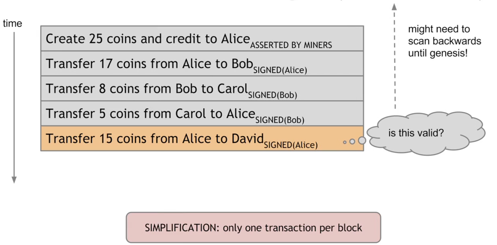

- We have to look over all transactions back there till the beginning of time to figure out if `Alice` has enough coins.
- Even if we put some data structure to keep track of `Alice's` balance, there is a lot more housing keeping despite the blockchain itself.
- So bitcoin does not use this model.

### An transaction-based ledger (Bitcoin)

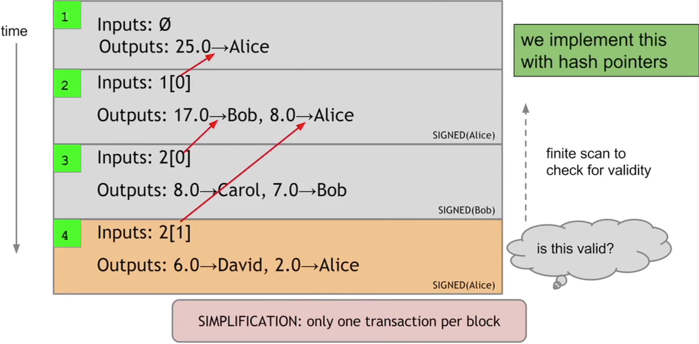

- Always completely consume the input by giving an equal output.
- Can trace back much easier by looking at the input pointer to check if the transaction is valid
- Implemented with hash pointers

#### Joint Payments

​	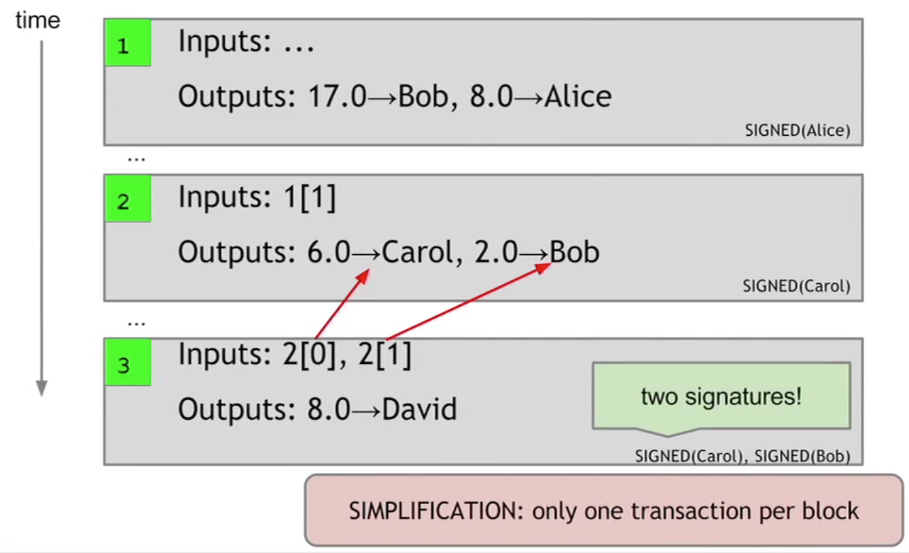

- Consume two inputs to joint pay `David`
- So needs two signatures as came from two different people

### Real deal: a Bitcoin transaction(very very close version)

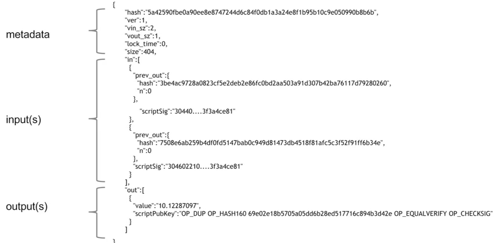

#### Metadata

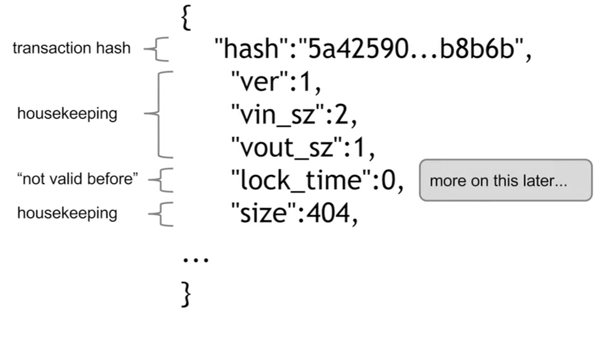

#### Input

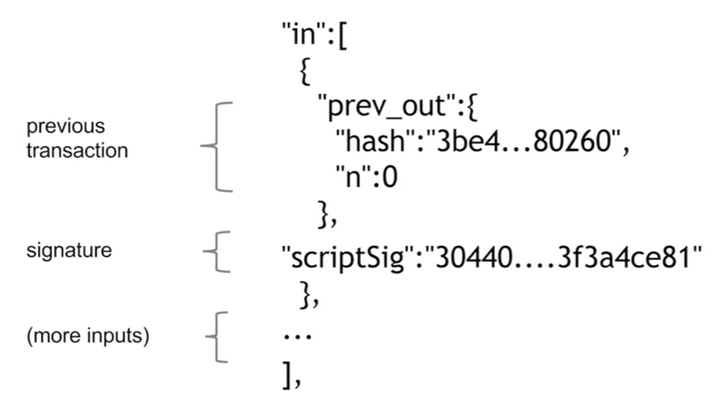

#### Output

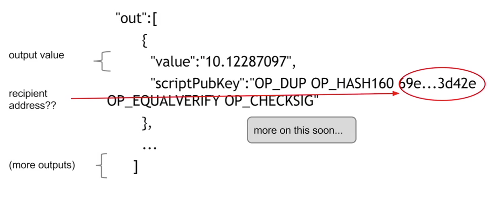

## Part 2 Bitcoin Scripts

### Output "addresses" are really `scripts` (`scriptPubKey`)

```
OP_DUP
OP_HASH160
69e02e18......
OP_EQUALVERIFY OP_CHECKSIG
```

### Input "addresses" are also `scripts` (`scriptSig`)

```
30440220....
0467d2c9....
```

### Verification

**TO VERIFY: Concatenated script must execute completely with no errors**

### Bitcoin scripting language ("Script")

Design goals:

- Built for Bitcoin (inspired by Forth — an old stack-based language)
- Simple, compact
- Support for cryptography
- Stack-based
- Limits on time/memory
- No looping
- Not Turing-complete languages (As designed to prevent over-powerful miners)

### Example

`<sig> <pubKey> OP_DUP OP_HASH160 <pubKeyHash?> OP_EQUALVERIFY OP_CHECKSIG`

- `<>` indicates data instructions
  - If seen just push to stack
  - Only memory interaction
- `<sig> <pubKey>`
  - Are the signature and the public key used to generate that signature
  - Specified by the recipient in that script sig component or input script
- `OP_DUP` make a copy of top of stack and push to stack
- `OP_HASH160` takes the top of stack and compute a cryptographic hash of it.
- `<pubKeyHash?>` specified by the sender of the coins.
- `OP_EQUALVERIFY`
  - Compare top 2 elements of the stack
  - If false, throw error and exist
  - Otherwise, pop top 2 elements
- `OP_CHECKSIG`
  - Check signature of the entire transaction
  - If true, pop the remaining elements of the stack `<sig> <pubKey>`
  - Otherwise, throw error

If we have no errors, we simply return True. Every Bitcoin script has only 2 outcomes: `Successful` or `Error`. If any error occurs, the transaction is invalid and should not be accepted.

### Bitcoin script instructions

256 opcodes total (15 disabled, 75 reserved)

- Arithmetic
- If/then
- Logic/data handling
- Crypto instructions
  - Hashes
  - Signature verification
  - **Multi-signature verification**
    - Built-in support for joint sigatures
    - Specify `n` pubKeys
    - Speicify `t` — a threshold 
    - Verification requires `t` signatures (`t of n` should be valid)
    - **BUG ALERT:** Extra data value posed from the stack and ignored

### Bitcoin scripts in practice (as of 2014)

- Most nodes whitelist now scripts
- `99.9%` are simple signature checks (like shown above in example)
- `~0.01%` are `MULTISIG`
- `~0.01%` are `Pay-to-Script-Hash`
- Remainder are errors, `proof-of-burn`
  - `proof-of-burn` is never going to redeem
  - To write arbitrary data into the blockchain
  - Destroy a small amount of currency to store a little bit of information on the network forever
  - To destroy coins to get coins in the new system

### `Pay-to-Script-Hash`

#### Should senders specify scripts?

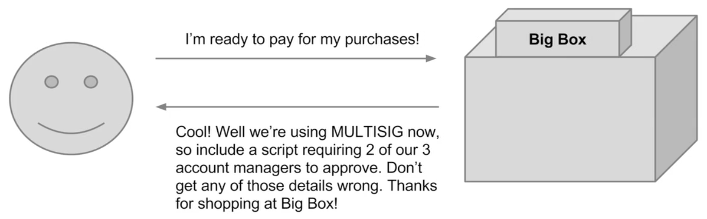

- As consumers we want to the transaction is easy

- So instead we allow pay to a hash address instead of `pubKey`

- Idea: use the hash of redemption script

  ```
  <signature>
  <<pubkey> OP_CHECKSIG> #contains a second step that deserialized to be a script itself
  ------------------
  OP_HASH160
  <hash of redemption script>
  OP_EQUAL
  ```

- Added after the original specification

- Benefits:

  - Removes the complexity of sender(consumer), only needs to send to an address
  - Efficiency gains we will talk later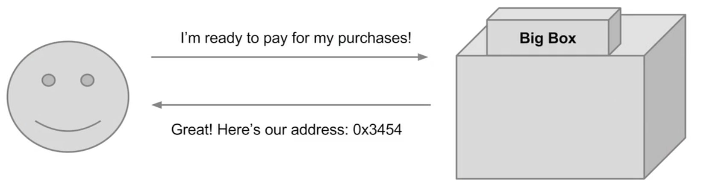

## Part 3 Applications of Bitcoin Scripts

### Example 1: Escrow Transactions

- **PROBLEM: `Alice` wants to buy online from` Bob`. `Alice` doesn't want to pay until after `Bob` ships. `Bob` doesn't want to shop until after `Alice  `pays.**

- Solutions (Introduce a third party `Judy` with `MULTISIG`):

  - `Alice` signs the statement: Pay `x` to **2-of-3** of `Alice, Bob, Judy` with `MULTISIG`

  - If`Alice` and `Bob` are both honest

    - Alice and Bob together sign the statement `Pay x to Bob`
    - The good thing here is `Judy` doesn't need to get involved in this case

  - Otherwise, in case someone cheated

    - `Alice `and `Bob` is never going to sign a statement together to `pay to Bob`
    - `Alice `and `Bob` is never going to sign a statement together to `pay to Alice`
    - Now `Judy` comes along and decide which one has cheated
      - Sign the payment with `Bob` to `Bob` if `Judy` think `Alice ` is cheating
      - Otherwise, Sign the payment with `Alice` to `Alice` if `Judy` think `Bob ` is cheating

    Judy has the full power here, the nice thing here is that she only needs to get involved when there is a dispute.

### Example 2: Green addresses

- **PROBLEM: Alice wants to pay bob. Bob can't wait 6 verifications to guard against double-spends or is offline completely.** 

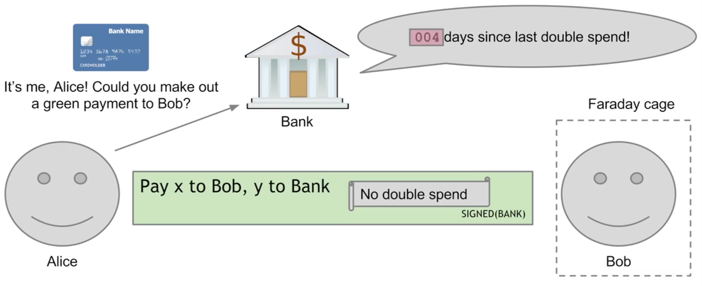

- Trust a third party `Bank` to transfer the payment

### Example 3: Efficient Micro-payments

- **PROBLEM:** Alice wants to pay Bob for each minute of phone service. She doesn't want to incur a transaction fee every time.

- Combine small payments into a big new payment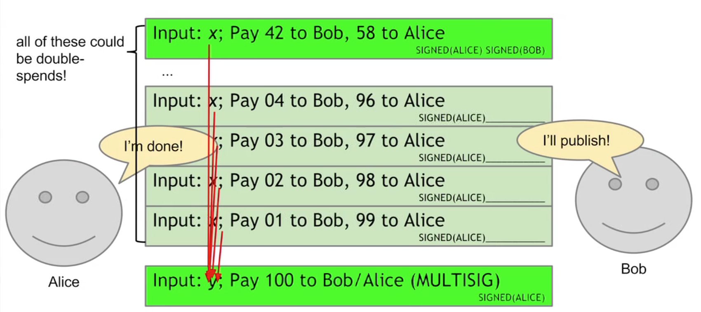

- All these transactions could be double spends if signed by both Alice and Bob

- Bob sign only the last transaction if Bob is honest

- What if Bob never signs? **This is when `lock_time` comes into play**

  **`loc_time` is the block index or real-word timestamp before which this transaction can't be published**, like a timed refund.

  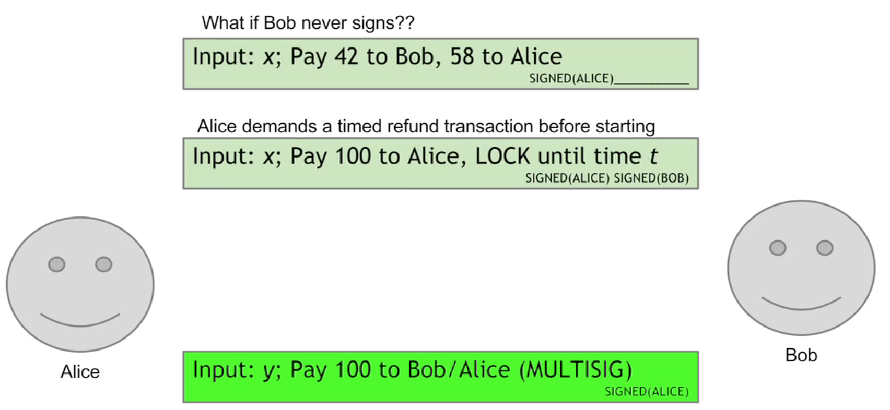

### More advanced scripts

- Multiplayer lotteries
- Hash pre-image challenges
- Coin-Swapping protocols
  - More on this in lecture on anonymity!
- "Smart contracts"

## Part 4 Bitcoin Blocks

### Why bundle transactions together

- Single unit of work for miners
- Limit length of hash-chain of blocks
  - Faster to verify history

### Bitcoin block structure (high-level)

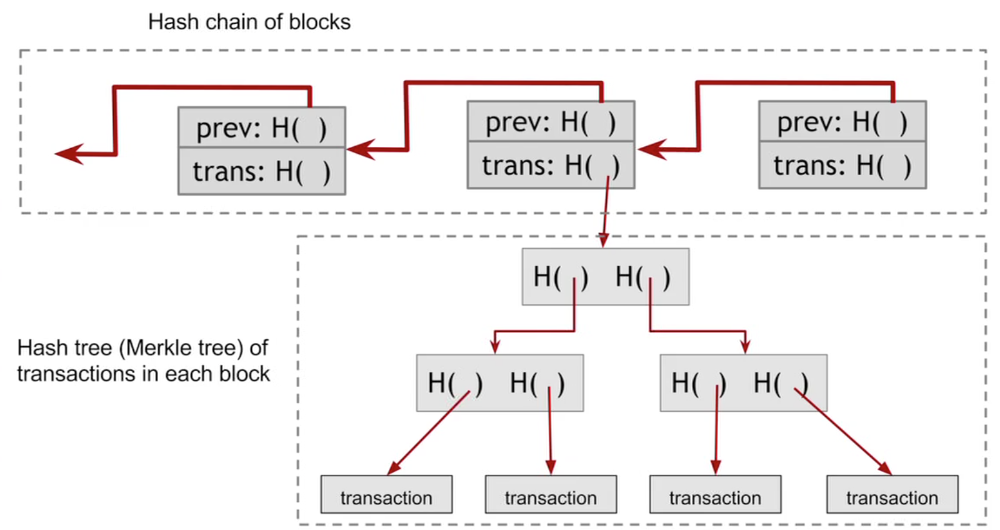

### Close-up look of a Block

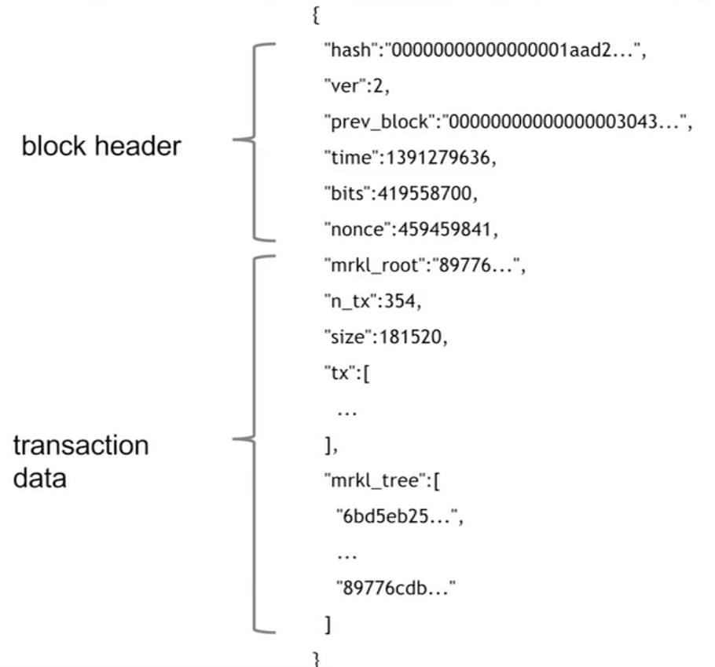

#### Block header

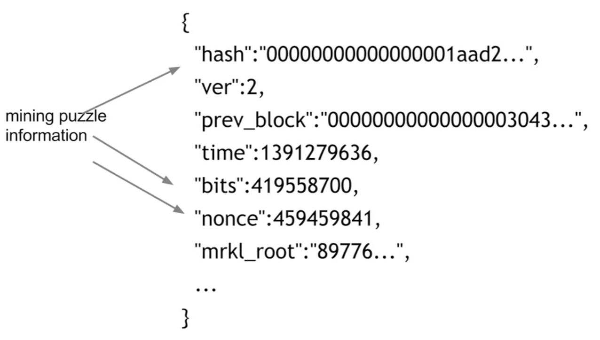

- Here the hash of block has to start with a number of 0s
- Only header is hashed during mining
- Only includes the root node of the Merkle tree

#### Coinbase transaction

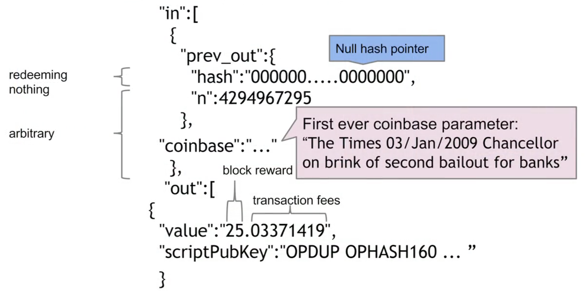

- **`Coinbase`**: a special parameter to put any arbitrary info, no limit what miners put there

## Part 5 The Bitcoin Network

### Bitcoin P2P network

- Ad-hoc protocol (runs on TCP port `8333`)
- Ad-hoc network with random topology
- All nodes are equal
- New nodes can join at any time
- Forget non-responding nodes after 3hr

### Joining the Bitcoin P2P network

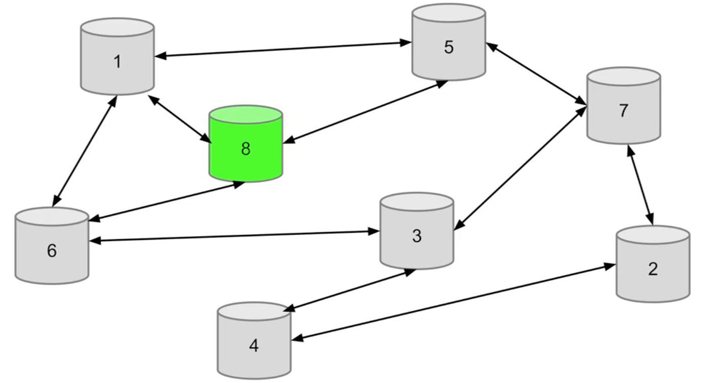

1. Find a `seed node` in the network
2. Talk to `seed node` and request its peers
3. Talk to those peers recursively until you have a list of nodes to connect to
4. Will end up with a random set o nodes connected to

### Transaction propagation (flooding)

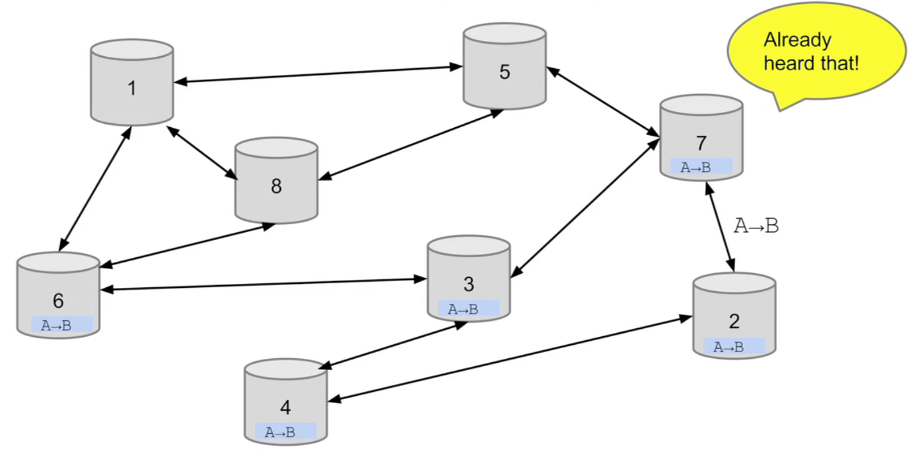

- Each node has a pool of transactions they heard about
- Suppose node 4 heard a transaction `From Alice to Bob`
- Node 4 talks to its peers and this is carried on recursively
- It won't loop around the network forever as transaction can be uniquely identified by hash
- This is often referred as the `gossip protocol`

### Node: should I relay a proposed transaction?

- Transaction valid with current blockchain

- (default) script matches a whitelist

  - Avoid unusual scripts

- Haven't seen before

  - Avoid infinite loops

- Doesn't conflict with others I've relayed

  - First come first served!


  - Avoid double-spends

- These `avoids` are just sanity checks, some nodes **may ignore them**

### Nodes may differ on transaction pool (Race conditions)

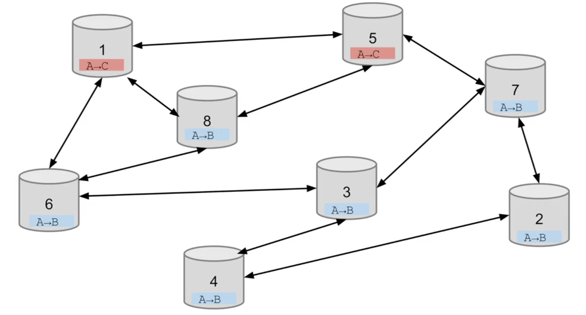

Transactions or blocks may conflict

- Default behavior: accept what you hear first
- Network position matters
- When one of the conflicting  transactions made into the block then other nodes know their transactions are never going to make it to the block, they will discard it (as they are double spends now)
- **Miners may implement other logic**
  - Stay tune for lecture on mining.

### Block propagation nearly identical

Relay a new block when you hear it if :

- Block meets the hash target
- Block has all valid transactions
  - Run all scripts even if you wouldn't relay
- Block builds on current longest chain
  - Avoid forks

### Propagation Times

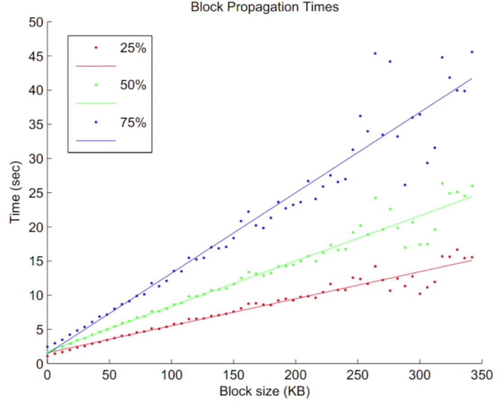

- Average at 30s which is really slow in Internet
- Node Topology is not optimized for speed
- Decentralized is ensured but sacrificed in terms of speed/efficiency

### How big is the network

- Impossible to measure exactly

- Estimates: up to 1M IP address/month

- Only about 5~10k full nodes

  - Permanently connected
  - Fully-validate
    - Permanently connected
    - Store entire block chain
    - Active network to hear and forward every node/transaction
    - Tracking the UTXO set
      - Stands for Unspent Transaction Output
        - Everything else can be sorted on disk
      - Currently ~12M UTXOs
        - Out of 44M transactions
      - Small enough to fit into RAM (less than 1GB for now)
  - This number is dropping

- Vast majority are instead `lightweight nodes`, or `simple payment verification clients` (often referred as `Thin/SPV clients ` )

  - Some personal wallet can just be `simple payment verification clients`, only checking if transactions coming to you are valid
  - Store block headers only
  - Request transactions as needed
    - To verify incoming payment
  - Trust fully-validating nodes
    - Not bad security tradeoff
    - As miners will always make sure the node is valid so it has a chance to get included in the main chain
  - 1000x cost savings (23MB v.s. 20GB)

- Size of entire blockchain is about 20GB

  

  ​