# Chapter 1 Basic Cryptography related

## Lecture 1 Hash function

### Hash function:

- Takes any string as input
- fixed-size output (`256bits` is what we use)
- efficiently computable
### Security Properties of Hash function
- **collision-free**
    - Idea: Nobody can find a pair $x,y$ s.t. $x \neq y$ yet $Hash(x) = Hash(y)$
    - Collisions do exist
      - Easy to illustrate, take our `256 bits` hash function as example: there are only $2^{256}$ outputs and undefined arbitrarily large amount of input strings. There has to be collisions.
    - So the key is to avoid regular people to find these collisions
    - Ways to find collisions
      - Try $2^{130}$ randomly chosen inputs, there are $99.8\%$ chance that two of them collide. But this takes too long to matter.
    - No hash functions up to now has been proven to be **collision-free**, it's just too hard to find a collision so we believe it as **collision-free**
    - Application of **collision-free**: Hash as message digest
      - If we know $H(x) = H(y)$, we can say $x=y$ as we believe $H$ is collision-free
      - So we can use it as a tool to compare large objects like files. Instead of comparing the whole file, we can just compare their hash which is significantly smaller. (In fact, `md5` is used to verify file integrity)

- **hiding**

    - Given $H(x)$, it is infeasible to find $x$.

    - No value of $x$ that is particularly likely. Set of value $x$ has to be very sparse. 

    - Concatenate $x$ with another value $r$ which is from a very sparse set (or $r$ is chosen from a probability distribution that has `high min-entrophy`) to sovle this problem. 
      `High min-entropy` means that the distribution is very `spread out`, so that no particular value is chosen with more than negligible probability.

      Then given $H(r \mid x)$, it is infeasible to find $x$.

    - Application: Commitment

      ```
      (com, key) := commit(msg)
      match := verify(com, key, msg)

      To seal msg in envelope:
      	(com, key) := commit(msg) #then publish com
      To open envelope:
      	publish key, msg
      	anyone can use verify to check its validity
      	
      #Implementation:
      commit(msg) := (H(key|msg), key) where key is a random 256-bit value
      verify(com, key, msg) := (H(key|msg) == com)

      #To have such security properties:
      	Hiding: given (H(key|msg), infeasible to find msg
      	Binding: Infeasible to find msg != msg' s.t. that (H(key|msg) == H(key|msg')
      ```

- **puzzle-friendly**

    - For every possible output value $y$, if $k$ is chosen from a distribution with high min-entropy, then it is infeasible to find $x$ s.t. $H(k\mid x) = y$

    - Application: Search puzzle

      ``` 
      Given a 'puzzle ID' id(from high min-entropy distrib) and a targe set Y, try to find a 'solution' x s.t. H(id | x) in Y.
      ```

### Example: SHA-256 hash function

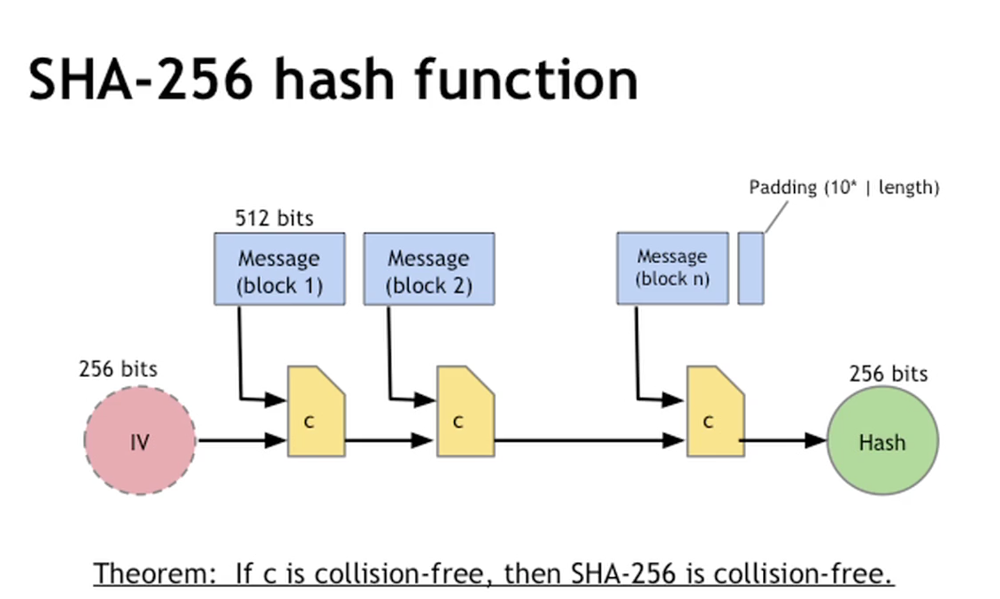

Algo walkthrough:

1. Take the original message and divide it up in chunks of `512bits​` size. The last block is padded with how many bits are there in the block and 0s to fill it up to `512bits​`.
2. After the message is partitioned, we take the `IV` key which is a `256bits` string and concatenate with the first chunk of message `block_1 ` to be a `768bits` message chunk.
3. Run this message chunk thru the compression algorithm `c` to produce a new `256bits` key and pass into the next execution with message `block_2`
4. Repeat until no blocks left; return hash.

**Th.** If `c` is collision-free, then `SHA-256` is collsiion free.

## Lecture 2 Hash pointers

### Hash pointer

- Pointer to where some info is stored
- and cryptographic hash of the info
- just like normal pointers, but not only where it is stored but also the hash of its data

With hash pointer, we can

- ask to get the info back
- certify that it hasn't changed

### Key idea: Build data structure with hash pointers

#### Example: Linkedlist with Hash pointers (blockchain)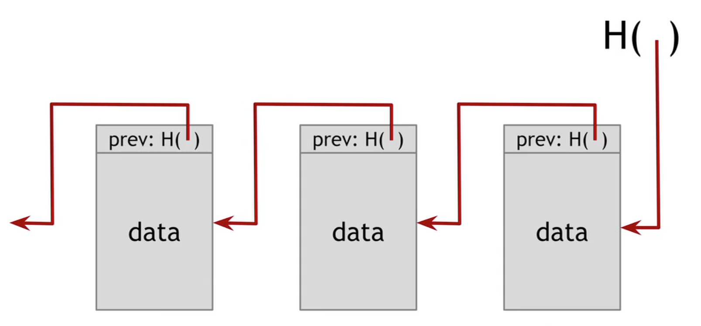

- we can build temper-evident log (If someone mess with data earlier we can detect it)

#### Example: binary tree with hash pointers (Merkle tree)

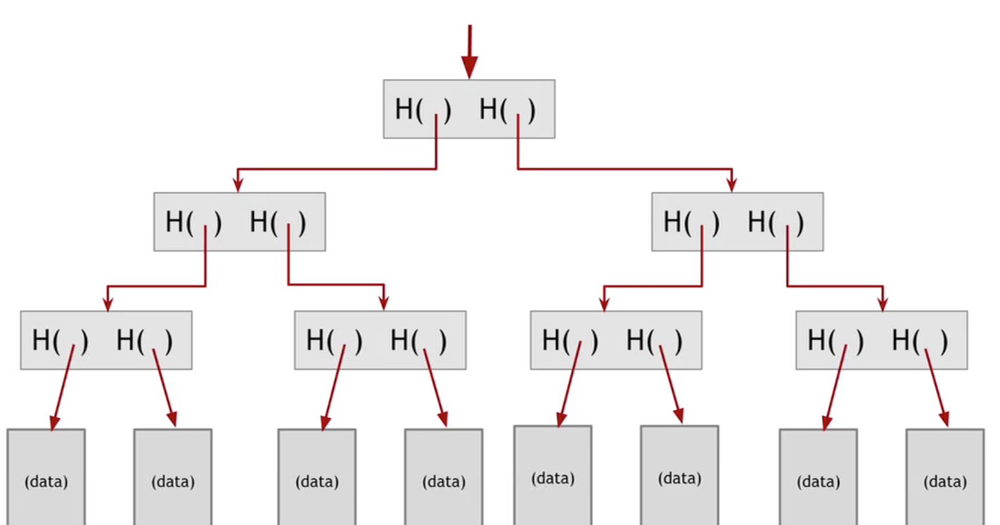

- Advantages:
  - Holds many items but only need to remember the root hash
  - Can verify membership in $O(\log n)$ time
- Variant: sorted Merkle tree (binary search tree with hash pointers)
  - can verify non-membership in $O(\log n)$ time (Prove nothing in between)

#### Generally

- Can use hash pointers in any pointer-based data structure that has not cycles

## Lecture 3 Digital Signatures

### Features of Signatures

- Only you can sign, but anyone can verify
- Signature is tied to particular document; can't be copy-and-pasted to another document

### API for digital signatures

```
(sk, pk) := generateKeys(keysize)
sig := sign(sk, message)
isValid := verify(pk, message, sig)
```

#### Requirements for signatures

- Valid signatures verify

  `verify(pk, message, sign(sk,message)) == true`

- Can't forge signatures

  - Adversary who
    - knows pk
    - gets to see signatures on messages of his choice
  - can't produce a verifiable signature on another message

#### Practical stuff

- Algorithms are randomized
  - good source of randomness required
- Limit on message isze
  - fix: use Hash(message) rather than message
- Fun trick: sign a hash pointer
  - signatures covers the whole structure (sign the entire content)
- Bitcoins uses `ECDSA(Elliptic Curve Digital Signature Algorithm)` standard
  - relies on extremely complicated maths
  - good randomness is extremely essential for ECDSA

## Lecture 4 Public Keys as Identities

### Useful trick: `pulic key == an identity`

- if you see `sig` s.t. `verify(pk, msg, sig) == true` ,

  In order to speak as `pk`, you need to have the matching private key `sk`.

### How to make a new identity

- create a new random key-pair `(sk, pk)`
- `pk` is the pubic "name" you can use, normally `H(pk)` as `pk` is large
- `sk` let's you speak as `pk`
- you control the identity because only you know `sk`
- if `pk` looks random, nobody needs to know who you are

### Decentralized identity management

- No need to use username, etc
- anyone can make a new identity anytime and make as many as wanted
- no central point of coordination
- these identities are called `address` or `wallet_address` in `Bitcoin`

### Privacy (how private it is)

- Addresses not directly connected to real-word identity
- But observer can link together an address's activity over time, make inferences
- Will talk this later

## Lecture 5 A simple Cryptocurrency

### Goofy Coin: Simplest Cryptocurrency

#### Rules:

- Goofy can create new coins that belongs to him

  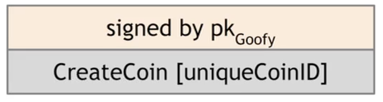

  `CreateCoin[uuid]` singed by `pk_goof`

- A coin's owner can spend it

  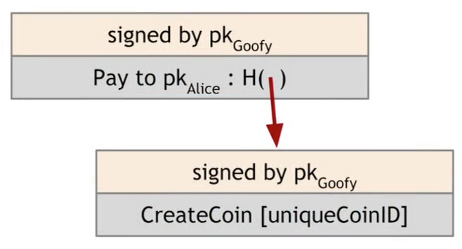

  - make a statement `pay to pk_alice` with hash pointer signed by `pk_goofy`

- The recipient can pass on the coin again

  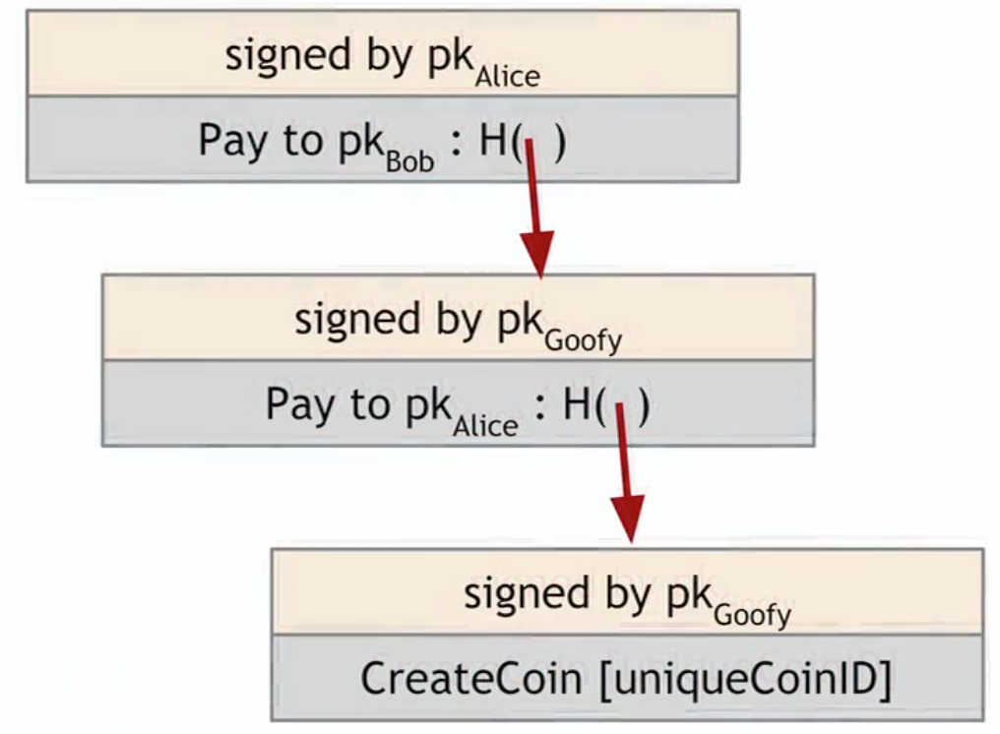

#### Problems

double-spending attack (one of the major design challenges)

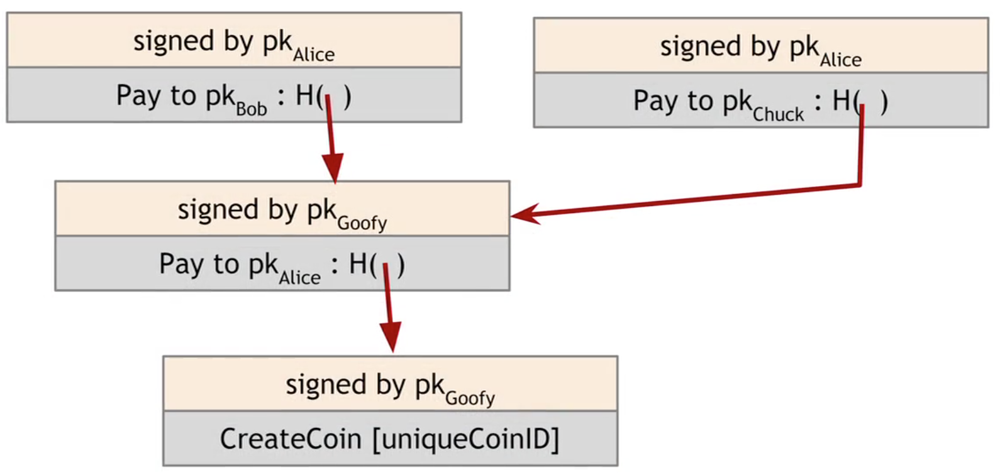

- both `Bob` and `Chuck` has a valid claim on the coin

### Scrooge Coin

#### Changes

- on top of goofy coin

- Scrooge publishes a history of all transactions(a blockchain signed by Scrooge)

  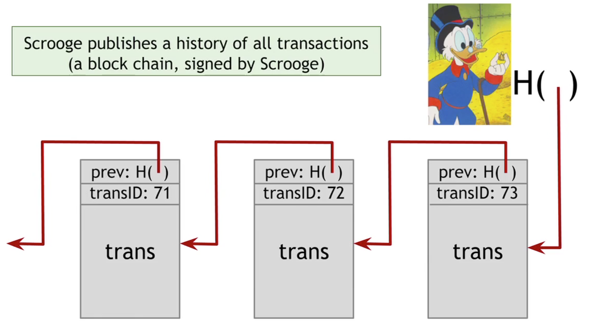

- Optimization: put multiple transactions in the same block

- Now everyone can detect double-spending

- New `CreateCoins` transaction

  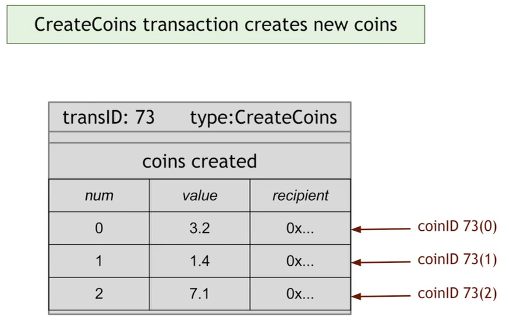

- New `PayCoin` transaction: 

  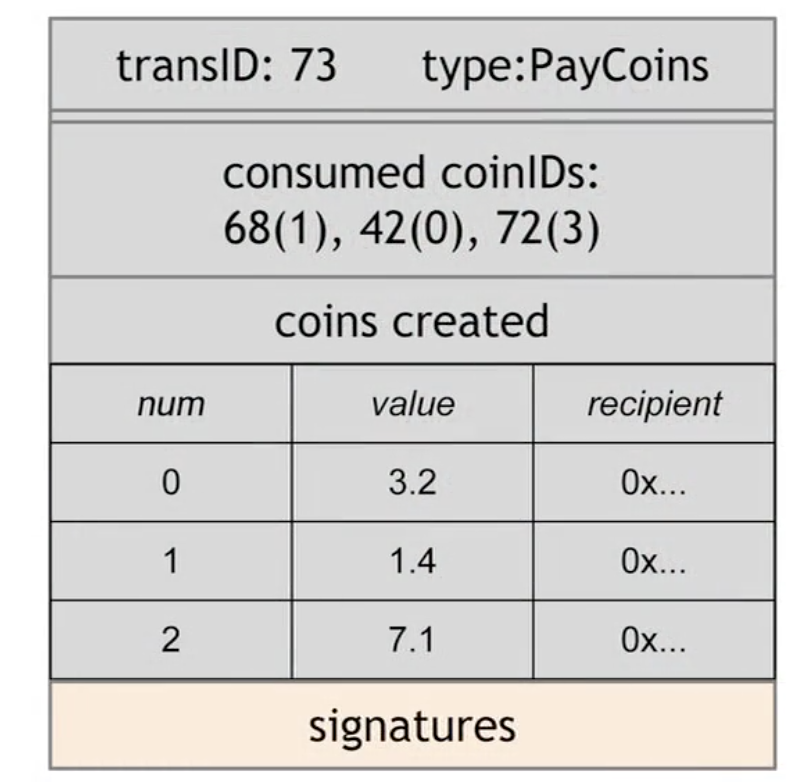

  - consumes some coins and creates new coins of the same total value
  - Valid if
    - consumed coins valid
    - not already consumed
    - total value out = total value in
    - signed by owners of all consumed coins

- New **<u>Immutable</u>** `Coin`

  - Coins can't be transferred, subdivided, or combined
  - But you can achieve the same effect by using transactions to subdivide
    - Create new trans that consume your coin and pay out two new coins to yourself with a same total value

#### Problem: Centralization

- Scrooge can be misbehaving

- Scrooge have to operate his functions all the time

- how to operate **without** any central, trusted party

- Problems to solve:

  If we can solve all of these problems, then we can build a currency that is very much like BitCoin. Which is like ScroogeCoin but without a centralized party.

  - How everyone can agree upon a single published block chain that is the agreed upon history which transactions have happened?
  - How people can agree which transactions are valid and which transactions have actually occurred?
  - How we can assign IDs to things in a decentralized way? 

#### Assignment: Scrooge Coin's public ledger


# Chapter 2 How Bitcoin achieves Decentralization

## Lecture 1 Centralization vs. Decentralization

### Decentralization is not "all-or-nothing"

- Email: Decentralized protocol (`smtp`), but dominated by centralized webmail services(`gmail`, `outlook`).

### Questions to answer about decentralization in Bitcoin

- Who maintains the ledger?
- Who has authority over which transactions are valid?
- Who creates new bitcoins?
- Who determines how the rules of the system change?
- How do bitcoins acquire exchange value?
- Beyond the protocol:
  - Exchanges
  - Wallet software
  - Service providers

### Aspects of decentralization in Bitcoin

- P2P (Peer-to-Peer) Network

  Open to anyone, low barrier to entry

- Mining

  Open to anyone, but inevitable concentration of power often seen as undesirable.

  Mainly due to the computing resource required to solve hard computational problem

- Updates to software

  Core developers trusted by community, they have a lot of power

## Lecture 2 Distributed Consensus

### Bitcoin's key challenge: <u>Distributed Consensus</u>

####Why consensus protocols?

- Traditional motivation: reliability in distributed systems. 

  *e.g. Possible database inconsistency issue*

- **<u>Distributed K-V store</u>**: enables various applications like

  DNS, public key directory, stock trades

#### Defining Distributed Consensus

- The protocol terminates
- All correct nodes decide on same **value**
- This **value** must have been proposed by some correct nodes

### Bitcoin is a peer-to-peer system

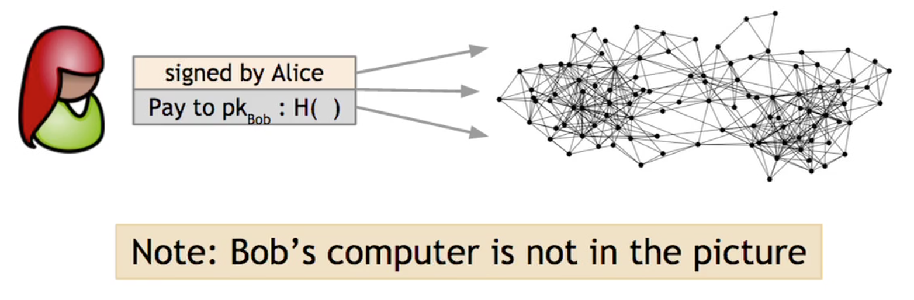

- When `Alice` wants to pay Bob:
  She broadcasts the transaction to all Bitcoin nodes
  - Alice's Signature
  - Bob's `pubkey`
  - Hash: hash pointer to the *"history"* of this coin
- Bob's computer is not in the picture
  - bitcoin is his no matter if he knows
- Order of transaction sequence
- Which nodes receive the broadcast

### How consensus "<u>could</u>" work in Bitcoin

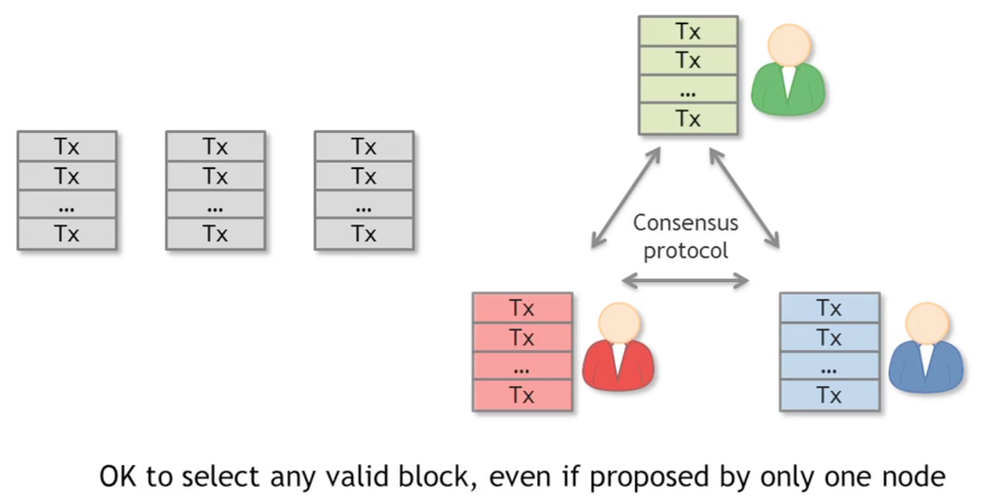

At any given time:

- All nodes have a sequence of **<u>blocks of transactions</u>** they've reached consensus on.
- Each node has a set of outstanding transactions it's heard about

### Why consensus is hard (technically)

- Nodes may crash

- Nodes may be malicious

- Network is imperfect

  - Not all pairs of nodes connected
  - Faults in network
  - Latency
    - No notion of global time
    - Not all nodes can agree to order of events by looking at timestamps, can't determine which transaction happens first

- Many impossibility results

  - Byzantine generals problem

    - [**How the Byzantine General Sacked the Castle: A Look Into Blockchain**](https://medium.com/@DebrajG/how-the-byzantine-general-sacked-the-castle-a-look-into-blockchain-370fe637502c)
    - [The Byzantine Generals’ Problem](https://medium.com/all-things-ledger/the-byzantine-generals-problem-168553f31480)
    - [Byzantine General's Problem Paper by EECS Berkeley](https://people.eecs.berkeley.edu/~luca/cs174/byzantine.pdf)

  - Fischer-Lunch-Paterson (deterministic nodes)

    Consensus impossible with a **<u>single</u>** faulty node

- Well-known protocols to solve this problems

  - Paxos
    - Never produces inconsistent result
    - Can (rarely) get stuck, fail to make any progress

- Understanding impossibility results

  - These tests are developed around the concept of distributed databases, not necessarily bitcoin


  - Bitcoin consensus works better in practice than in theory
  - Theory is still catching up
  - But theory is important as it can help predict unforeseen attacks

### Some things Bitcoin does differently

Bitcoin does not quite solve **<u>Distributed Consensus</u>** Problem in a general sense, but solves it in the context of a currency system.

- Introduces incentives
  - Possible only because it's a currency
- Embraces randomness
  - Does away with the notion of a specific end-point
  - Consensus happens over long time scales — about 1 hour
    - But even at the end of that time, you're not a 100% sure that a transaction or a block that you're interested in has made it into the consensus block chain. Instead, as time goes on, your probability goes up higher and higher. And the probability that you're wrong in making an assumption about a transaction goes down exponentially. 
    - So that's the kind of inherently probabilistic guarantee that Bitcoin gives you. And that's why it's able to completely get around these traditional impossibility results on distributed consensus protocols. 

